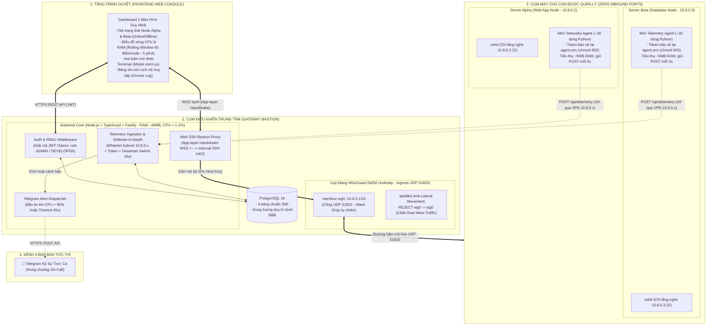
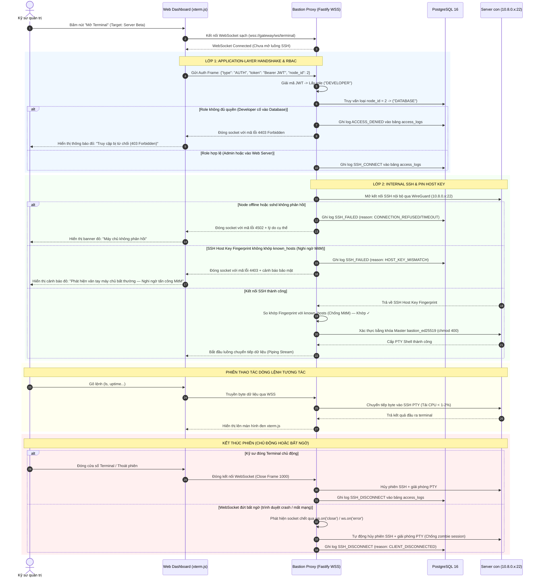
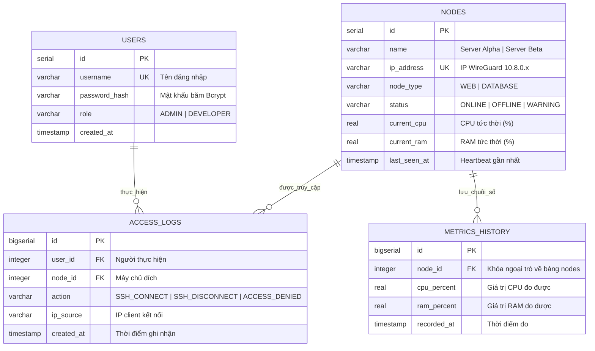

# 🏛️ ĐẶC TẢ KIẾN TRÚC & THIẾT KẾ KỸ THUẬT: ZT-SERVEROPS
> **Đề tài chính thức trên Sheet:** Thiết lập máy chủ VPN sử dụng WireGuard để quản lý máy chủ  
> **Tên khoa học chính thức:** Hệ thống quản trị máy chủ không mở cổng dịch vụ (Zero Inbound Ports) qua mạng ngầm WireGuard  
> **Mã sản phẩm:** `ZT-ServerOps` (Zero-Trust Server Operations Platform)  
> **Đơn vị thực hiện:** Nhóm 9 — Đồ án Cơ sở ngành (GVHD: Thầy Nguyễn Đắc Hải)  
> **Phiên bản tài liệu:** v1.1 — Bản cập nhật kiến trúc an ninh & chuẩn hóa Zero Trust

---

## 1. TỔNG QUAN BÀI TOÁN & NGUYÊN TẮC ZERO TRUST

### 1.1. Hiện trạng gốc & Lý do chuyển đổi
* **Bài toán gốc:** Thiết lập mạng VPN WireGuard đơn thuần để các máy tính kết nối nội bộ (bài lab quản trị mạng cơ bản).
* **Mô hình nâng cấp:** Chuyển đổi WireGuard thành **Lớp mạng ngầm máy-với-máy (Machine-to-Machine Security Underlay)** và xây dựng **Nền tảng Quản trị & Giám sát Tập trung (Web Console & Web SSH Bastion)**.
* **Ánh xạ Mô hình Zero Trust (Theo chuẩn NIST SP 800-207):**
  1. **Xác thực tường minh (Verify Explicitly):** Không tin tưởng bất kỳ kết nối nào mặc định. Trình duyệt phải thực hiện bắt tay xác thực JWT tại tầng ứng dụng (Application-layer Handshake); Agent máy con gửi dữ liệu phải qua 2 lớp phòng thủ phân tầng: Lớp mạng xác thực subnet WireGuard và Lớp ứng dụng xác thực mật mã `X-Node-Token`.
  2. **Đặc quyền tối thiểu (Least Privilege):** Thực thi phân quyền vai trò (RBAC) nghiêm ngặt tại Control Plane: Kỹ sư có role `DEVELOPER` chỉ được phép quản trị máy Web, bị từ chối tuyệt đối (`403 Forbidden`) khi cố mở terminal vào máy Database.
  3. **Phân đoạn mạng & Chống xâm nhập ngang (Micro-segmentation & Anti-Lateral Movement):** Mạng WireGuard là mạng ngầm nội bộ M2M chỉ dành riêng cho Gateway và các Managed Nodes. **Kỹ sư KHÔNG được cấp VPN profile cá nhân** để triệt tiêu hoàn toàn khả năng vượt mặt (bypass) tầng RBAC. Đồng thời, Gateway chặn triệt để lưu lượng ngang giữa các node (**East-West Traffic Filtering**).
  4. **Giả định bị xâm nhập (Assume Breach):** Dù phiên SSH chạy hoàn toàn bên trong đường hầm WireGuard, Gateway Backend vẫn thực hiện **Pin SSH Host Key** (kiểm tra vân tay máy con) để phòng chống nguy cơ tấn công Man-in-the-Middle (MitM) nội bộ.

### 1.2. Thu Hẹp Bề Mặt Tấn Công & Cơ Chế Mạng Cốt Lõi
* **Zero Inbound Ports (Tại các máy chủ con):** Các máy chủ con (Node Alpha, Node Beta) **đóng 100% cổng kết nối chiều vào từ Internet** (kể cả cổng 22 SSH). Toàn bộ kết nối được thiết lập Outbound từ máy con tới Gateway.
* **Cơ chế NAT Traversal kép (`PersistentKeepalive = 25` & Telemetry Heartbeat 5s):**  
  * Do máy chủ con nằm sau các tầng NAT/Firewall cục bộ và là bên chủ động tạo kết nối Outbound, bảng ánh xạ trạng thái NAT (NAT State Table) của router trung gian thường tự động xóa sau 30–60 giây nếu không có dữ liệu.
  * Việc Agent gửi Telemetry định kỳ mỗi 5 giây vốn đã liên tục làm ấm phiên NAT. Cờ `PersistentKeepalive = 25` đóng vai trò là **chốt chặn dự phòng ở tầng giao thức mạng L3/L4 của WireGuard**. Kể cả khi script Agent tầng ứng dụng tạm dừng hoặc khởi động lại, tunnel VPN vẫn duy trì kết nối thông suốt, đảm bảo Gateway có thể chủ động mở phiên SSH vào máy con bất kỳ lúc nào.
* **Kiểm Soát Cổng Vào Gateway (Gateway Ingress Control):**  
  * **Cổng Mạng Ngầm VPN (UDP 51820):** Là ngõ vào duy nhất dành cho các đường hầm WireGuard từ máy con. Nhóm tận dụng **cơ chế Silent Drop tự nhiên của WireGuard**: loại bỏ trong im lặng mọi gói tin UDP không có chữ ký mật mã hợp lệ. Kẻ tấn công dùng `nmap` quét vào sẽ chỉ nhận trạng thái `closed` hoặc `open|filtered`, hoàn toàn không thể dò quét vân tay dịch vụ (service fingerprinting).
  * **Cổng Quản Trị Web Console (TCP 443 / 8080):** Là ngõ vào giao diện điều khiển duy nhất dành cho Kỹ sư qua trình duyệt web (HTTPS/WSS), được kiểm soát bởi Application-layer RBAC, Rate Limiting và bọc sau Reverse Proxy/WAF.

---

## 2. KIẾN TRÚC HỆ THỐNG TOÀN DIỆN (SYSTEM ARCHITECTURE)

Hệ thống chốt cứng công nghệ: **Frontend (React / Tailwind)**, **Backend (Node.js với TypeScript & Fastify siêu nhẹ)**, **Cơ sở dữ liệu (PostgreSQL 16)**:



---

## 3. SƠ ĐỒ TUẦN TỰ & CHIẾN LƯỢC QUẢN LÝ KHÓA BASTION

### 3.1. Cơ Chế Quản Lý Cặp Khóa `bastion_ed25519`
* **Khởi tạo & Lưu trữ:** Cặp khóa `bastion_ed25519` là **Khóa Master Bastion dùng chung toàn Gateway**, được sinh tự động 1 lần duy nhất khi dựng container Gateway:
  ```bash
  ssh-keygen -t ed25519 -f /etc/zt-bastion/bastion_ed25519 -N "" -C "bastion@zt-serverops"
  chmod 400 /etc/zt-bastion/bastion_ed25519
  ```
* **Cơ chế phân phối:** Khóa công khai (`bastion_ed25519.pub`) được nạp sẵn vào file `~/.ssh/authorized_keys` của tất cả các máy con khi khởi tạo. Khóa riêng được bảo vệ nghiêm ngặt bằng quyền file `chmod 400` bên trong container Gateway, chỉ có tiến trình Backend Fastify mới có quyền đọc để mở phiên SSH nội bộ.
* **Phân tích Trade-off & Mở rộng Enterprise:** Trong quy mô đồ án nghiên cứu, việc sử dụng Master Bastion Key tập trung đảm bảo tính tinh gọn và khả năng dựng tự động bằng Docker. Trong môi trường doanh nghiệp quy mô lớn, kiến trúc này có thể nâng cấp lên **SSH Certificate Authority (SSH CA)**: Gateway sinh chứng chỉ SSH có thời hạn ngắn (Short-lived SSH Certificates, ví dụ 15 phút) gắn với danh tính của từng phiên làm việc.

### 3.2. Quản Lý Phiên JWT & Bảo Mật Giao Tiếp WSS (Application-layer Handshake)
* **Lưu trữ an toàn tại Client:** JWT Token được lưu trữ trong **Bộ nhớ tạm thời (Memory State / sessionStorage)** của ứng dụng React, không lưu vĩnh viễn trong `localStorage` để giảm thiểu nguy cơ bị đánh cắp qua tấn công XSS.
* **Phòng vệ tầng HTTP Headers:** Backend Fastify kích hoạt plugin bảo mật `@fastify/helmet` thiết lập tiêu đề `Content-Security-Policy (CSP)` chặt chẽ, `X-Frame-Options: DENY` (chống Clickjacking), và `X-Content-Type-Options: nosniff`.
* **Lý do thực hiện Application-layer Handshake qua WSS:** Chuẩn API `WebSocket` trên trình duyệt không hỗ trợ gửi kèm Header tùy biến (như `Authorization: Bearer ...`) trong quá trình bắt tay HTTP Upgrade ban đầu. Do đó, hệ thống thiết lập kết nối WebSocket sạch, sau đó **bắt buộc frame dữ liệu đầu tiên** gửi lên phải là `AUTH Frame` chứa JWT Token để giải mã và phân quyền RBAC.
* **Vòng đời Token (TTL):** JWT Token được cấu hình thời hạn hiệu lực ngắn (**TTL = 1 giờ**). Khi hết hạn, người dùng chỉ cần đăng nhập lại; kiến trúc đồ án không duy trì bảng Refresh Token phức tạp nhằm giữ hệ thống siêu nhẹ và triệt tiêu trạng thái phiên lưu vết trên máy chủ (Stateless Auth).

### 3.3. Sơ Đồ Tuần Tự Luồng Thao Tác Web SSH



---

## 4. CƠ SỞ DỮ LIỆU TỐI ƯU HÓA (4 BẢNG CHUẨN 3NF)



### 💡 Cơ Chế Cửa Sổ Trượt (Rolling Window 60 Điểm / Node)
* **Quy mô & Giá trị sử dụng:** Giới hạn **60 điểm đo** được áp dụng **trên từng máy chủ riêng biệt (Per-node basis)**. Với tần suất gửi 5 giây/điểm, 60 điểm tương đương **5 phút theo dõi xu hướng liên tục**, giúp kỹ sư nhận diện rõ ràng các đợt tăng tải đột biến hoặc rò rỉ bộ nhớ.
* **Kỹ thuật Phi chuẩn hóa có chủ đích (Intentional Denormalization):**  
  Hai cột `current_cpu` và `current_ram` tại bảng `nodes` được duy trì đồng thời với chuỗi thời gian trong `metrics_history`. Đây là quyết định thiết kế có chủ đích: Giao diện Dashboard chỉ cần chạy 1 câu truy vấn đơn giản `SELECT * FROM nodes` là lấy được trạng thái tức thời của toàn bộ máy chủ mà không cần thực hiện phép tính tổng hợp (`MAX`, `LATEST`) hoặc phép nối (`JOIN`) tốn kém trên bảng lịch sử, đảm bảo thời gian phản hồi API luôn đạt mức dưới 10ms.
* **Tính toán định lượng tài nguyên (PostgreSQL Storage Calculation):**  
  Trong PostgreSQL, mỗi hàng dữ liệu bao gồm phần tiêu đề `HeapTupleHeaderData` (~23 bytes), padding canh hàng bộ nhớ và dữ liệu các cột (`bigint`, `integer`, `real`, `real`, `timestamp` $\approx$ 28 bytes), chiếm thực tế khoảng **~60–80 bytes/bản ghi** trên đĩa. Với 2 máy con, bảng `metrics_history` lưu trữ tối đa $60 \times 2 = 120$ bản ghi, tương đương khoảng **~9.6 KB** bộ nhớ. Kể cả khi mở rộng cụm thử nghiệm lên 10 nodes, dung lượng cũng chỉ khoảng ~48 KB — hoàn toàn bảo đảm tiêu chí cơ sở dữ liệu duy trì siêu nhẹ **< 5MB**.
* **Đánh Index & Thực thi SQL:**  
  Để lệnh xoay vòng dữ liệu và truy vấn lịch sử không bao giờ bị quét toàn bảng (Full Table Scan), hệ thống thiết lập Composite Index:
  ```sql
  -- Tối ưu hóa truy vấn lịch sử và câu lệnh dọn dẹp DELETE theo từng node:
  CREATE INDEX idx_metrics_node_time ON metrics_history (node_id, recorded_at DESC);
  ```
  Quá trình ghi nhận và dọn dẹp được thực thi tự động trong Transaction mỗi khi nhận gói tin Telemetry:
  ```sql
  -- 1. Thêm bản ghi mới cho node:
  INSERT INTO metrics_history (node_id, cpu_percent, ram_percent, recorded_at) 
  VALUES ($1, $2, $3, NOW());

  -- 2. Cập nhật chỉ số tức thời vào bảng nodes (Denormalized Cache):
  UPDATE nodes 
  SET current_cpu = $2, current_ram = $3, last_seen_at = NOW(), status = 'ONLINE' 
  WHERE id = $1;

  -- 3. Tự động xoay vòng dọn dẹp bản ghi cũ hơn 60 điểm của chính node đó:
  DELETE FROM metrics_history 
  WHERE node_id = $1 AND id NOT IN (
      SELECT id FROM metrics_history 
      WHERE node_id = $1 
      ORDER BY recorded_at DESC 
      LIMIT 60
  );
  ```

---

## 5. BẢO MẬT PHÒNG THỦ ĐA TẦNG (DEFENSE-IN-DEPTH)

### 5.1. Mô Hình 2 Lớp Bảo Vệ Cho API Telemetry
Dữ liệu đo lường từ máy con gửi về Gateway qua endpoint `POST /api/telemetry` phải vượt qua **2 tầng phòng ngự độc lập**:
* **Lớp 1 (Network Layer - Tầng mạng):** Middleware kiểm tra IP nguồn của gói tin HTTP. Gói tin bắt buộc phải bắt nguồn từ dải mạng nội bộ WireGuard (`10.8.0.0/24`). Mọi gói tin gửi từ Internet công cộng tới endpoint này sẽ bị **Từ chối ngay lập tức** trước khi vào logic ứng dụng.
* **Lớp 2 (Application Layer - Tầng ứng dụng):** Header `X-Node-Token` được đối chiếu với Token bí mật của máy chủ lưu trong DB. Token trên máy con được lưu tại file `/etc/zt-agent/agent.env` với phân quyền `chmod 600` (chỉ root mới đọc được). Điều này ngăn ngừa triệt để nguy cơ giả mạo dữ liệu giữa các node (Node Spoofing) nếu một node trong mạng bị thỏa hiệp.
* **Phân định Scope Rate Limiting (Theo từng IP nguồn độc lập - Per-Source-IP):**  
  Cơ chế Rate Limit (1 request / 3 giây) được áp dụng **độc lập trên từng địa chỉ IP nguồn** (`10.8.0.2` có bucket riêng, `10.8.0.3` có bucket riêng). Do đó, các máy chủ con gửi dữ liệu đồng thời sẽ không bao giờ bị nghẽn hay xung đột chéo lẫn nhau. Ngưỡng 3 giây là **chốt chặn chống tấn công từ chối dịch vụ (Anti-DoS/Flood)** ngăn ngừa tình huống node bị chiếm quyền cố tình spam làm nghẽn DB và gây nhiễu loạn cảnh báo Telegram.
* **Chiến lược Retry & Backoff của Agent khi bị Rate Limit (HTTP 429):**  
  Trong hoạt động bình thường, Agent gửi mỗi 5 giây — lớn hơn ngưỡng Rate Limit 3 giây nên không bị chặn. Tuy nhiên, nếu gặp lỗi mạng tạm thời (timeout/packet drop) và Agent retry ngay lập tức, request thứ hai có thể rơi vào cửa sổ 3 giây và bị từ chối `429 Too Many Requests`. Để tránh mất dữ liệu âm thầm, Agent áp dụng chiến lược **Retry with Jittered Backoff**: Khi nhận HTTP 429, Agent đợi thêm `3 + random(0–2)` giây rồi mới gửi lại, đảm bảo không vi phạm Rate Limit trong lần thử tiếp theo. Nếu vẫn thất bại sau 2 lần retry, Agent bỏ qua gói tin đó (chấp nhận mất tối đa 1 điểm đo không quan trọng) và trở lại chu kỳ bình thường 5 giây.

### 5.2. Phân Đoạn Mạng & Chống Xâm Nhập Ngang (Anti-Lateral Movement)
Trong mô hình Zero Trust, nguyên tắc *Assume Breach* yêu cầu phải giả định bất kỳ node nào cũng có thể bị chiếm quyền. Nếu Node Alpha (Web) bị tấn công RCE, kẻ tấn công không được phép lợi dụng đường hầm WireGuard để tấn công trực tiếp sang Node Beta (Database):
* **Cấu hình Firewall trên Gateway:** WireGuard hoạt động theo mô hình Hub-and-Spoke. Gateway thiết lập quy tắc iptables chặn đứng chuyển tiếp gói tin giữa các peer:
  ```bash
  # Chặn định tuyến ngang giữa các máy con trong dải mạng wg0 (East-West Traffic)
  iptables -A FORWARD -i wg0 -o wg0 -j REJECT --reject-with icmp-admin-prohibited
  ```
* **Kết quả bảo vệ:** Node Alpha (`10.8.0.2`) chỉ có thể giao tiếp duy nhất với Gateway (`10.8.0.1`). Mọi nỗ lực quét cổng hay gửi gói tin từ Alpha sang Beta (`10.8.0.3`) đều bị Gateway từ chối ngay lập tức tại tầng kernel mạng.

### 5.3. Cơ Chế Deadman Switch & Ngưỡng Cảnh Báo Telegram
* **Nguyên lý Deadman Switch:** Backend định kỳ kiểm tra trường `last_seen_at` trong bảng `nodes`. Nếu thời gian trôi qua vượt quá ngưỡng timeout mà không nhận được gói tin Telemetry mới, hệ thống kết luận máy chủ đã mất tín hiệu và kích hoạt bot Telegram cảnh báo.
* **Chuẩn hóa ngưỡng Timeout (45–60 giây):**
  * Tần suất gửi Telemetry của Agent: **5 giây / lần**.
  * Chu kỳ Keepalive của WireGuard: **25 giây / lần**.
  * Nếu đặt ngưỡng cảnh báo quá ngắn (như 15s), chỉ cần 3 gói tin bị nghẽn mạng Internet tạm thời (packet drop/jitter) thì hệ thống đã báo động nhầm (False Alarm).
  * Ngưỡng **45–60 giây** tương đương 9–12 chu kỳ gửi tin thất bại liên tiếp (hoặc 2 chu kỳ Keepalive trôi qua). Đây là ngưỡng chuẩn mực trong SRE, vừa đảm bảo phát hiện sự cố nhanh chóng (dưới 1 phút), vừa triệt tiêu hiện tượng báo động giả gây mệt mỏi cảnh báo (Alert Fatigue).

### 5.4. Chốt Cứng Công Nghệ Backend: Node.js + TypeScript + Fastify
* Tiêu thụ tài nguyên siêu nhẹ (**RAM ~35–40MB**, nhẹ hơn Express gấp 2 lần).
* Hỗ trợ chuẩn xác cho WebSocket (thư viện `@fastify/websocket` bọc `ws`).
* Sử dụng thư viện chuẩn `ssh2` làm Bastion Client chuyển tiếp luồng byte mượt mà, tải CPU **< 1–2%**.
* Dùng chung TypeScript với Frontend React, tái sử dụng định nghĩa kiểu dữ liệu (DTO Interfaces).

---

## 6. DANH MỤC API CONTRACTS TINH GỌN (5 ENDPOINTS)

| Method | Endpoint | Xác thực & Ràng buộc | Mục đích sử dụng |
| :--- | :--- | :---: | :--- |
| `POST` | `/api/auth/login` | Public (Rate Limit: 5 req/15 phút per IP) | Đăng nhập bằng `username`/`password`, nhận JWT Token (TTL: 1 giờ, chứa role `ADMIN` hoặc `DEVELOPER`). Khóa tài khoản tạm thời sau 10 lần sai liên tiếp để chống tấn công brute-force (OWASP A07). |
| `GET` | `/api/nodes` | Bearer JWT | Lấy danh sách máy chủ, IP nội bộ, trạng thái Online/Offline và tải CPU/RAM hiện tại. |
| `GET` | `/api/nodes/:id/history` | Bearer JWT | Lấy **60 điểm dữ liệu CPU/RAM gần nhất (5 phút xu hướng)** của máy chủ để vẽ biểu đồ sóng. |
| `POST` | `/api/telemetry` | `X-Node-Token` + Whitelist `10.8.0.x` | Nhận dữ liệu do Agent gửi về mỗi 5s (Rate Limit: 1 req/3s áp dụng theo từng IP nguồn). |
| `GET` | `/api/access-logs` | Bearer JWT | Lấy danh sách 20 phiên truy cập gần nhất để hiển thị bảng nhật ký kiểm toán. |

---

## 7. CẨM NANG TRẢ LỜI PHẢN BIỆN & KỊCH BẢN DEMO THỰC CHIẾN

### 7.1. Cẩm Nang Trả Lời Phản Biện (Cheat Sheet)

* **Hỏi:** *"Hệ thống quảng cáo Zero Inbound Ports nhưng Gateway vẫn phải mở cổng, vậy có mâu thuẫn không?"*  
  $\rightarrow$ **Trả lời:** *"Dạ thưa thầy cô, khái niệm Zero Inbound Ports áp dụng triệt để cho toàn bộ các máy chủ dịch vụ (Managed Nodes) — tức toàn bộ máy chứa ứng dụng và cơ sở dữ liệu đóng 100% cổng kết nối từ Internet, triệt tiêu hoàn toàn nguy cơ bị quét port nmap. Tại Gateway trung tâm, hệ thống áp dụng nguyên tắc Single Hardened Ingress Point: ngõ vào mạng ngầm duy nhất là UDP 51820 được bảo vệ bởi cơ chế tàng hình Silent Drop của WireGuard, còn giao diện Web Console được kiểm soát chặt chẽ bằng JWT và RBAC đa tầng ạ."*

* **Hỏi:** *"Nếu Developer có cấu hình WireGuard VPN, họ có thể SSH thẳng vào máy Database và bỏ qua RBAC ở Web Console không?"*  
  $\rightarrow$ **Trả lời:** *"Dạ thưa thầy cô, trong mô hình thiết kế của nhóm, Kỹ sư KHÔNG được cấp tài khoản hay profile WireGuard. Mạng ngầm WireGuard là mạng máy-với-máy (M2M Underlay) độc quyền giữa Gateway và các Node con. Kỹ sư chỉ thao tác thông qua Web Console trên trình duyệt và bị kiểm soát chặt chẽ bởi Middleware RBAC. Ngoài ra, tại Gateway, nhóm thiết lập luật tường lửa iptables chặn triệt để luồng traffic ngang giữa các node (`REJECT wg0 -> wg0`), nên kể cả khi một node con bị chiếm quyền thì cũng không thể tấn công lan sang node khác ạ."*

* **Hỏi:** *"Khóa SSH Bastion `bastion_ed25519` được quản lý ra sao? Ai xoay vòng nó?"*  
  $\rightarrow$ **Trả lời:** *"Dạ thưa thầy cô, `bastion_ed25519` là cặp khóa Master của trạm trung chuyển Bastion, được sinh tự động khi khởi tạo Gateway. Khóa công khai được cấu hình sẵn trong authorized_keys của các máy con, còn khóa riêng được bảo vệ bằng quyền root chmod 400 trong container Gateway. Đối với quy mô đồ án, đây là giải pháp tập trung tối ưu; trong thực tế doanh nghiệp, việc xoay vòng khóa (Key Rotation) định kỳ 90 ngày hoặc chuyển sang SSH Certificate Authority (SSH CA) ký chứng chỉ ngắn hạn 15 phút là hướng mở rộng tiếp theo ạ."*

* **Hỏi:** *"Tại sao ngưỡng cảnh báo mất kết nối lại đặt 45–60 giây thay vì 15 giây?"*  
  $\rightarrow$ **Trả lời:** *"Dạ thưa thầy cô, trong môi trường mạng thực tế, việc gửi gói tin qua Internet có thể gặp hiện tượng nghẽn mạng tạm thời (packet jitter/drop). Nếu đặt ngưỡng 15s (chỉ tương đương 3 nhịp gửi 5s), hệ thống sẽ gặp hiện tượng báo động giả liên tục (False Positives). Đồng thời, chu kỳ NAT Keepalive của WireGuard là 25s. Do đó, ngưỡng 45–60 giây (tương đương 9–12 chu kỳ gửi tin thất bại liên tiếp hoặc 2 chu kỳ Keepalive) là ngưỡng chuẩn mực trong SRE, vừa đảm bảo phát hiện sự cố nhanh chóng dưới 1 phút, vừa triệt tiêu báo động giả ạ."*

* **Hỏi:** *"Tại sao API Telemetry đã nằm trong mạng WireGuard rồi mà vẫn cần cả IP Whitelist lẫn Token?"*  
  $\rightarrow$ **Trả lời:** *"Dạ thưa thầy cô, đây là kiến trúc Phòng thủ Đa tầng (Defense-in-Depth):  
  1. **Lớp mạng (L3/L4 IP Whitelist):** Bảo đảm request chỉ đến từ interface ảo WireGuard (`10.8.0.0/24`), loại bỏ mọi request từ các interface khác.  
  2. **Lớp ứng dụng (L7 Secret Token):** Xác thực định danh chính xác của từng node. Nếu không có Token bí mật (được lưu với quyền `chmod 600`), một node bị chiếm quyền (ví dụ Node Alpha) có thể giả mạo địa chỉ IP gửi dữ liệu sai lệch của Node Beta lên hệ thống. Token giúp định danh chính xác ai đang báo cáo số liệu ạ."*

* **Hỏi:** *"Biểu đồ sóng lưu 60 điểm dữ liệu có làm phình cơ sở dữ liệu không?"*  
  $\rightarrow$ **Trả lời:** *"Dạ thưa thầy cô, nhóm áp dụng cơ chế Cửa sổ trượt (Rolling Window per-node) tự động dọn dẹp bằng SQL Transaction. 60 điểm đo (tương đương 5 phút xu hướng) của mỗi node chỉ chiếm khoảng ~9.6 KB. Toàn bộ cụm thử nghiệm chỉ tốn vài chục KB, bảo đảm cơ sở dữ liệu luôn duy trì dưới 5MB và không bao giờ bị phình đĩa ạ."*

---

### 7.2. Bảng Kịch Bản Kiểm Thử Thực Chiến Khi Demo (Adversarial Demo Scenarios)

Nhóm chuẩn bị sẵn 4 kịch bản kiểm thử phá hoại để thực hiện trực tiếp trước Hội đồng chấm đồ án:

| Mã | Kịch bản kiểm thử phá hoại | Thao tác thực hiện khi Demo | Phản ứng kỳ vọng của hệ thống | Ý nghĩa chứng minh kỹ thuật |
| :---: | :--- | :--- | :--- | :--- |
| **T1** | **Vượt quyền RBAC (Bypass Authorization)** | Đăng nhập tài khoản `Developer`, bấm mở Web Terminal vào Node Beta (Database Node). | Hệ thống chặn ngay lập tức, ngắt socket với mã `4403`, hiện cảnh báo đỏ *"Truy cập bị từ chối (403 Forbidden)"*, DB ghi nhận log `ACCESS_DENIED`. | Chứng minh cơ chế Least Privilege hoạt động chuẩn xác tại tầng Application Middleware. |
| **T2** | **Quá tải CPU đột biến (CPU Stress Spike)** | Chạy script `simulation/stress.sh` đẩy CPU Node Alpha lên 100%. | Biểu đồ sóng chuyển sang dải đỏ cảnh báo tải > 90%. Trong vòng dưới 10 giây, Bot Telegram rung chuông điện thoại gửi tin cảnh báo sự cố. | Chứng minh hệ thống Telemetry thời gian thực và kênh cảnh báo tức thì On-Call hoạt động trơn tru. |
| **T3** | **Sập máy chủ đột ngột (Deadman Switch Failure)** | Chạy lệnh `docker stop node-alpha` giả lập máy chủ con mất nguồn hoặc đứt mạng hoàn toàn. | Sau 45–60 giây (vượt ngưỡng Deadman Switch), thẻ Node Alpha chuyển sang trạng thái `OFFLINE`, Bot Telegram gửi tin nhắn cảnh báo mất tín hiệu. | Chứng minh cơ chế Deadman Switch chuẩn SRE, loại bỏ hoàn toàn báo động giả do trễ mạng thông thường. |
| **T4** | **Tấn công lan ngang (East-West Lateral Movement)** | Mở terminal SSH trên Node Alpha (`10.8.0.2`), gõ lệnh `ping 10.8.0.3` hoặc `curl 10.8.0.3`. | Gói tin bị Gateway từ chối ngay lập tức tại tầng Kernel (`ICMP admin prohibited`), không thể kết nối tới Node Beta. | Chứng minh quy tắc `iptables` phân đoạn mạng (Micro-segmentation) hoạt động, triệt tiêu nguy cơ máy Web bị hack tấn công sang máy DB. |
