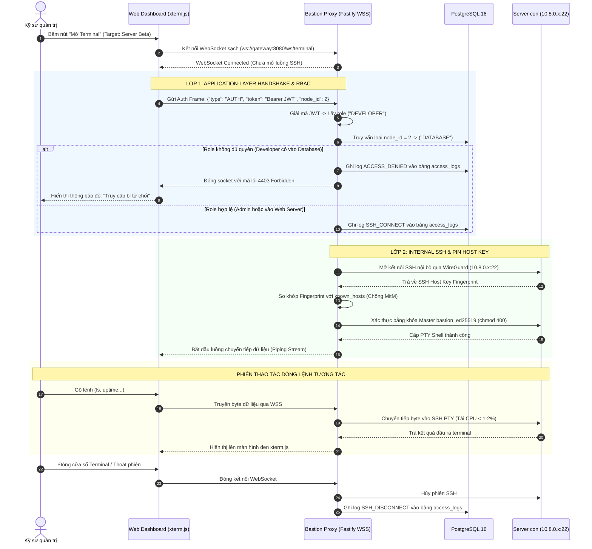
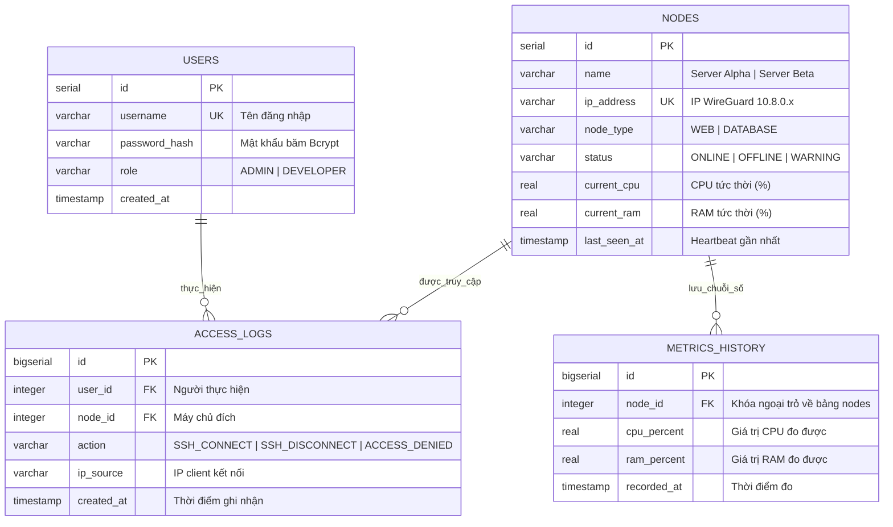

# 🏛️ ĐẶC TẢ KIẾN TRÚC & THIẾT KẾ KỸ THUẬT: ZT-SERVEROPS
> **Đề tài chính thức trên Sheet:** Thiết lập máy chủ VPN sử dụng WireGuard để quản lý máy chủ  
> **Tên khoa học chính thức:** Hệ thống quản trị máy chủ không mở cổng dịch vụ (Zero Inbound Ports) qua mạng ngầm WireGuard  
> **Mã sản phẩm:** `ZT-ServerOps` (Zero-Trust Server Operations Platform)  
> **Đơn vị thực hiện:** Nhóm 9 — Đồ án Cơ sở ngành (GVHD: Thầy Nguyễn Đắc Hải)  
> **Phiên bản tài liệu:** v1.0 — Bản nghiệm thu kỹ thuật chính thức

---

## 1. TỔNG QUAN BÀI TOÁN & NGUYÊN TẮC ZERO TRUST

### 1.1. Hiện trạng gốc & Lý do chuyển đổi
* **Bài toán gốc:** Thiết lập mạng VPN WireGuard đơn thuần để các máy tính kết nối nội bộ (bài lab quản trị mạng cơ bản).
* **Mô hình nâng cấp:** Chuyển đổi thành **Nền tảng Quản trị & Giám sát Máy chủ Tập trung (Web Console & Web SSH Bastion)**.
* **Ánh xạ Mô hình Zero Trust (Theo chuẩn NIST SP 800-207):**
  1. **Xác thực tường minh (Verify Explicitly):** Không tin tưởng bất kỳ kết nối nào mặc định. Trình duyệt phải thực hiện bắt tay xác thực JWT tại tầng ứng dụng (Application-layer Handshake); Agent máy con gửi dữ liệu phải qua 2 lớp phòng thủ (Network IP + Secret Token).
  2. **Đặc quyền tối thiểu (Least Privilege):** Thực thi phân quyền vai trò (RBAC): Tài khoản `Developer` chỉ được phép quản trị máy Web, bị chặn tuyệt đối khi cố mở terminal vào máy Database.
  3. **Giả định bị xâm nhập (Assume Breach):** Dù phiên SSH chạy hoàn toàn bên trong đường hầm WireGuard, Backend vẫn thực hiện **Pin SSH Host Key** (kiểm tra vân tay máy con) để phòng chống nguy cơ tấn công Man-in-the-Middle (MitM) nội bộ.

### 1.2. Thu Hẹp Bề Mặt Tấn Công & Cơ Chế Mạng Cốt Lõi
* **Zero Inbound Ports (Tại các máy chủ con):** Các máy chủ con (Node Alpha, Node Beta) **đóng 100% cổng kết nối chiều vào từ Internet** (kể cả cổng 22 SSH). Toàn bộ kết nối được thiết lập Outbound từ máy con tới Gateway.
* **Vai trò sống còn của `PersistentKeepalive = 25`:**  
  Do máy chủ con nằm sau các tầng NAT/Firewall cục bộ và là bên chủ động tạo kết nối Outbound, bảng ánh xạ trạng thái NAT (NAT State Table) của router trung gian thường tự động xóa sau 30–60 giây nếu không có dữ liệu. Cờ `PersistentKeepalive = 25` định kỳ gửi gói tin rỗng mỗi 25 giây để **duy trì phiên NAT Traversal thông suốt**, đảm bảo Gateway có thể chủ động kết nối SSH vào máy con bất kỳ lúc nào mà máy con không cần IP công khai.
* **Single Controlled Ingress Point & Silent Drop tại Gateway:**  
  * Cổng công khai duy nhất mở ra Internet của toàn hệ thống là **UDP 51820 (WireGuard)** tại Gateway.
  * **Làm rõ cơ chế Silent Drop:** Đây là **đặc tính bảo mật mật mã tự nhiên vốn có của giao thức WireGuard** mà nhóm chủ động nghiên cứu và tận dụng. WireGuard mặc định loại bỏ trong im lặng (*Silent Drop*) mọi gói tin UDP không có chữ ký mật mã (Cryptographic Cookie/Handshake) hợp lệ. Kẻ tấn công dùng `nmap` quét vào Gateway sẽ chỉ nhận trạng thái `closed` hoặc `open|filtered`, hoàn toàn không thể dò quét vân tay dịch vụ (service fingerprinting).

---

## 2. KIẾN TRÚC HỆ THỐNG TOÀN DIỆN (SYSTEM ARCHITECTURE)

Hệ thống chốt cứng công nghệ: **Frontend (Next.js/React + Tailwind)**, **Backend (Node.js với TypeScript & Fastify siêu nhẹ)**, **Cơ sở dữ liệu (PostgreSQL 16)**:

```mermaid
flowchart TD
    %% TẦNG 1: FRONTEND
    subgraph ClientLayer ["1. TẦNG TRÌNH DUYỆT (FRONTEND WEB CONSOLE)"]
        UI_Dash["Dashboard 1 Màn Hình Duy Nhất\n- Thẻ trạng thái Node Alpha & Beta (Online/Offline)\n- Biểu đồ sóng CPU & RAM (Rolling Window 20 điểm/node)\n- Nút bấm mở Web Terminal (Modal xterm.js)\n- Bảng tra cứu Lịch sử truy cập (Access Log)"]
    end

    %% TẦNG 2: CONTROL PLANE
    subgraph ControlPlane ["2. CỤM ĐIỀU KHIỂN TRUNG TÂM (GATEWAY BASTION)"]
        direction TB
        subgraph BackendCore ["Backend Core (Node.js + TypeScript + Fastify - RAM ~40MB, CPU < 1-2%)"]
            AuthModule["Auth & RBAC Middleware\n(Giải mã JWT Claims: role ADMIN / DEVELOPER)"]
            BastionProxy["Web SSH Bastion Proxy\n(App-layer Handshake WSS <---> Internal SSH ssh2)"]
            TelemetryIngest["Telemetry Ingestion & Defense-in-Depth\n(Whitelist IP nội bộ 10.8.0.x + Token + Deadman Switch)"]
            AlertService["Telegram Alert Dispatcher\n(Bắn tin khi CPU > 90% hoặc Timeout 15s)"]
        end

        DB[(PostgreSQL 16\n- 4 bảng chuẩn 3NF\n- Dung lượng duy trì < 5MB)]
        
        subgraph WireGuardHub ["Lớp Mạng WireGuard (Single Ingress Point)"]
            WG0["Interface wg0: 10.8.0.1/24\n(Cổng UDP 51820 - Silent Drop tự nhiên)"]
        end
    end

    %% TẦNG 3: MANAGED NODES
    subgraph FleetLayer ["3. CỤM MÁY CHỦ CON ĐƯỢC QUẢN LÝ (ZERO INBOUND PORTS)"]
        subgraph NodeAlpha ["Server Alpha (Web App Node - 10.8.0.2)"]
            SSH_A["sshd (Chỉ lắng nghe 10.8.0.2:22)"]
            Agent_A["Mini Telemetry Agent (~30 dòng Python)\n- Token bảo vệ tại agent.env (chmod 600)\n- Tiêu thụ ~5MB RAM, gửi POST mỗi 5s"]
        end

        subgraph NodeBeta ["Server Beta (Database Node - 10.8.0.3)"]
            SSH_B["sshd (Chỉ lắng nghe 10.8.0.3:22)"]
            Agent_B["Mini Telemetry Agent (~30 dòng Python)\n- Token bảo vệ tại agent.env (chmod 600)\n- Tiêu thụ ~5MB RAM, gửi POST mỗi 5s"]
        end
    end

    %% NGOẠI VI
    subgraph AlertChannel ["4. KÊNH CẢNH BÁO TỨC THÌ"]
        TelegramApp["📱 Telegram Kỹ Sư Trực Ca (Rung chuông On-Call)"]
    end

    %% LUỒNG TƯƠNG TÁC
    UI_Dash <==>|HTTP REST API (JWT)| AuthModule
    UI_Dash <==>|WSS sạch (App-layer Handshake)| BastionProxy

    AuthModule <--> DB
    TelemetryIngest <--> DB
    TelemetryIngest -->|Kích hoạt cảnh báo| AlertService
    AlertService -.->|HTTPS POST API| TelegramApp

    BastionProxy ==>|SSH nội bộ (Pin Host Key)| WG0
    WG0 <===>|Đường hầm mã hóa UDP 51820| FleetLayer

    Agent_A -.->|POST /api/telemetry (chỉ qua VPN 10.8.0.x)| TelemetryIngest
    Agent_B -.->|POST /api/telemetry (chỉ qua VPN 10.8.0.x)| TelemetryIngest
```

---

## 3. SƠ ĐỒ TUẦN TỰ & CHIẾN LƯỢC QUẢN LÝ KHÓA BASTION

### 3.1. Cơ Chế Quản Lý Cặp Khóa `bastion_ed25519`
* **Khởi tạo & Lưu trữ:** Cặp khóa `bastion_ed25519` là **Khóa Master Bastion dùng chung toàn Gateway**, được sinh tự động 1 lần duy nhất khi dựng container Gateway:
  ```bash
  ssh-keygen -t ed25519 -f /etc/zt-bastion/bastion_ed25519 -N "" -C "bastion@zt-serverops"
  chmod 400 /etc/zt-bastion/bastion_ed25519
  ```
* **Cơ chế phân phối:** Khóa công khai (`bastion_ed25519.pub`) được nạp sẵn vào file `~/.ssh/authorized_keys` của tất cả các máy con khi khởi tạo. Khóa riêng được bảo vệ nghiêm ngặt bằng quyền file `chmod 400` bên trong container Gateway, chỉ có tiến trình Backend Fastify mới có quyền đọc để mở phiên SSH nội bộ.

### 3.2. Sơ Đồ Tuần Tự Luồng Thao Tác Web SSH



---

## 4. CƠ SỞ DỮ LIỆU TỐI ƯU HÓA (4 BẢNG CHUẨN 3NF)



### 💡 Cơ Chế Cửa Sổ Trượt (Rolling Window Per-Node)
* **Quy mô:** Giới hạn 20 điểm đo là **áp dụng trên từng máy chủ riêng biệt (Per-node basis)**. Bảng `metrics_history` chứa tối đa 40 bản ghi (với 2 máy con), dung lượng toàn bộ database duy trì **< 5MB**.
* **Thực thi SQL:** Được thực hiện tự động trong Transaction mỗi khi nhận gói tin Telemetry:
  ```sql
  -- 1. Thêm bản ghi mới cho node:
  INSERT INTO metrics_history (node_id, cpu_percent, ram_percent, recorded_at) 
  VALUES ($1, $2, $3, NOW());

  -- 2. Dọn bản ghi cũ hơn giới hạn 20 điểm của chính node đó:
  DELETE FROM metrics_history 
  WHERE node_id = $1 AND id NOT IN (
      SELECT id FROM metrics_history 
      WHERE node_id = $1 
      ORDER BY recorded_at DESC 
      LIMIT 20
  );
  ```

---

## 5. BẢO MẬT PHÒNG THỦ ĐA TẦNG (DEFENSE-IN-DEPTH)

### 5.1. Mô Hình 2 Lớp Bảo Vệ Cho API Telemetry
Dữ liệu đo lường từ máy con gửi về Gateway qua endpoint `POST /api/telemetry` phải vượt qua **2 tầng phòng ngự độc lập**:
* **Lớp 1 (Network Layer - Tầng mạng):** Middleware kiểm tra IP nguồn của gói tin HTTP. Gói tin bắt buộc phải bắt nguồn từ dải mạng nội bộ WireGuard (`10.8.0.0/24`). Mọi gói tin gửi từ Internet công cộng tới endpoint này sẽ bị **Từ chối ngay lập tức** trước khi vào logic ứng dụng.
* **Lớp 2 (Application Layer - Tầng ứng dụng):** Header `X-Node-Token` được đối chiếu với Token bí mật của máy chủ được lưu trong DB. Token trên máy con được lưu tại file `/etc/zt-agent/agent.env` với phân quyền `chmod 600` (chỉ root mới đọc được).
* **Phân định Scope Rate Limiting (Theo từng IP nguồn độc lập - Per-Source-IP):**  
  Cơ chế Rate Limit (1 request / 3 giây) được áp dụng **độc lập trên từng địa chỉ IP nguồn** (`10.8.0.2` có bucket riêng, `10.8.0.3` có bucket riêng). Do đó, các máy chủ con gửi dữ liệu đồng thời sẽ không bao giờ bị nghẽn hay xung đột chéo lẫn nhau. Ngưỡng 3 giây là **chốt chặn chống tấn công từ chối dịch vụ (Anti-DoS/Flood)** ngăn ngừa tình huống node bị chiếm quyền cố tình spam làm nghẽn DB và gây nhiễu loạn cảnh báo Telegram (Alert Fatigue).

### 5.2. Chốt Cứng Công Nghệ Backend: Node.js + TypeScript + Fastify
* Tiêu thụ tài nguyên siêu nhẹ (**RAM ~35–40MB**, nhẹ hơn Express gấp 2 lần).
* Hỗ trợ chuẩn xác cho WebSocket (thư viện `@fastify/websocket` bọc `ws`).
* Sử dụng thư viện chuẩn `ssh2` làm Bastion Client chuyển tiếp luồng byte mượt mà, tải CPU **< 1–2%**.
* Dùng chung TypeScript với Frontend Next.js, tái sử dụng định nghĩa kiểu dữ liệu (DTO Interfaces).

---

## 6. DANH MỤC API CONTRACTS TINH GỌN (5 ENDPOINTS)

| Method | Endpoint | Xác thực & Ràng buộc | Mục đích sử dụng |
| :--- | :--- | :---: | :--- |
| `POST` | `/api/auth/login` | Public | Đăng nhập bằng `username`/`password`, nhận JWT Token (chứa role `ADMIN` hoặc `DEVELOPER`). |
| `GET` | `/api/nodes` | Bearer JWT | Lấy danh sách máy chủ, IP nội bộ, trạng thái Online/Offline và tải CPU/RAM hiện tại. |
| `GET` | `/api/nodes/:id/history` | Bearer JWT | Lấy 20 điểm dữ liệu CPU/RAM gần nhất của máy chủ để vẽ biểu đồ sóng xu hướng. |
| `POST` | `/api/telemetry` | `X-Node-Token` + Whitelist `10.8.0.x` | Nhận dữ liệu do Agent gửi về mỗi 5s (Rate Limit: 1 req/3s áp dụng theo từng IP nguồn). |
| `GET` | `/api/access-logs` | Bearer JWT | Lấy danh sách 20 phiên truy cập gần nhất để hiển thị bảng nhật ký kiểm toán. |

---

## 7. CẨM NANG TRẢ LỜI PHẢN BIỆN (CHEAT SHEET)

* **Hỏi:** *"Khóa SSH Bastion `bastion_ed25519` được quản lý ra sao? Ai xoay vòng nó?"*  
  $\rightarrow$ **Trả lời:** *"Dạ thưa thầy cô, `bastion_ed25519` là cặp khóa Master của trạm trung chuyển Bastion, được sinh tự động khi khởi tạo Gateway. Khóa công khai được cấu hình sẵn trong authorized_keys của các máy con, còn khóa riêng được bảo vệ bằng quyền root chmod 400 trong container Gateway. Đối với quy mô đồ án, đây là giải pháp tập trung tối ưu; trong thực tế doanh nghiệp, việc xoay vòng khóa (Key Rotation) định kỳ 90 ngày hoặc chuyển sang SSH Certificate Authority (SSH CA) là hướng mở rộng tiếp theo ạ."*

* **Hỏi:** *"Tại sao cần `PersistentKeepalive = 25` nếu WireGuard đã có bắt tay mã hóa?"*  
  $\rightarrow$ **Trả lời:** *"Dạ thưa thầy cô, các máy con nằm sau mạng NAT cục bộ và là bên chủ động quay kết nối Outbound tới Gateway. Router NAT trung gian thường xóa bảng trạng thái sau 30-60 giây nếu đường truyền không có dữ liệu. Cờ `PersistentKeepalive = 25` giúp định kỳ gửi gói tin giữ phiên NAT Traversal luôn mở, đảm bảo Gateway có thể chủ động kết nối SSH vào máy con bất kỳ lúc nào ạ."*

* **Hỏi:** *"Tại sao hệ thống tuân thủ Zero Trust theo NIST SP 800-207?"*  
  $\rightarrow$ **Trả lời:** *"Dạ thưa thầy cô, hệ thống áp dụng đầy đủ 3 trụ cột cốt lõi của NIST 800-207:  
  1. **Verify Explicitly:** Xác thực danh tính JWT qua Application Handshake trên WebSocket và Token máy con.  
  2. **Least Privilege:** Phân quyền RBAC tại Middleware, chặn Developer truy cập máy Database.  
  3. **Assume Breach:** Dù gói tin chạy trong VPN WireGuard, Backend vẫn Pin SSH Host Key của máy con để phòng chống tấn công MitM nội bộ ạ."*
