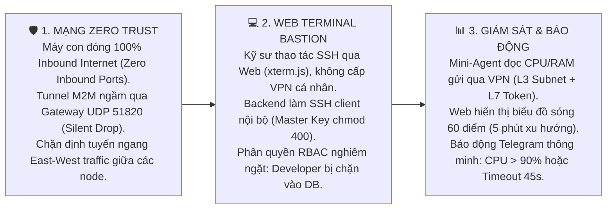

# 📑 TỔNG QUAN DỰ ÁN: ZT-SERVEROPS
> **Tên đề tài chính thức trên Sheet:** Thiết lập máy chủ VPN sử dụng WireGuard để quản lý máy chủ  
> **Tên khoa học chính thức:** Hệ thống quản trị máy chủ không mở cổng dịch vụ (Zero Inbound Ports) qua mạng ngầm WireGuard  
> **Mã sản phẩm:** `ZT-ServerOps` (Zero-Trust Server Operations Platform)  
> **Đơn vị thực hiện:** Nhóm 9 — Đồ án Cơ sở ngành (GVHD: Thầy Nguyễn Đắc Hải)  
> **Thời gian đọc:** ~2 phút để nắm trọn vẹn toàn bộ dự án

---

## 1. DỰ ÁN NÀY LÀ GÌ? (TÓM TẮT TRONG 3 CÂU)
1. **Xuất phát điểm:** Đề tài gốc của trường giao là dựng VPN WireGuard để quản lý máy chủ.
2. **Nâng cấp thành sản phẩm:** Nhóm nâng cấp WireGuard thành **Lớp mạng ngầm máy-với-máy (Machine-to-Machine Security Underlay)** và phát triển **Nền tảng Quản trị & Giám sát Tập trung (Web Console & Web SSH Bastion)**.
3. **Giá trị cốt lõi:** Kỹ sư mở **Web Terminal gõ lệnh SSH trực tiếp trên trình duyệt web** trong khi toàn bộ máy chủ con **đóng 100% cổng kết nối (Zero Inbound Ports) ra Internet**. Bề mặt tấn công mạng ngầm được thu hẹp về một điểm ngõ vào duy nhất (**Single Hardened Ingress Point - UDP 51820**) tại Gateway với cơ chế tàng hình tự nhiên *Silent Drop*. Kỹ sư không được cấp VPN profile cá nhân, loại bỏ hoàn toàn nguy cơ vượt mặt (bypass) kiểm soát phân quyền RBAC ở tầng mạng.

---

## 2. BẢNG THÔNG SỐ ĐỊNH LƯỢNG HỆ THỐNG (METRICS AT A GLANCE)

| Tiêu chí kỹ thuật | Thông số đo kiểm thực tế | Ý nghĩa thực tiễn |
| :--- | :---: | :--- |
| **Công nghệ Backend** | **Node.js + TypeScript + Fastify** | RAM siêu nhẹ (~40MB), hiệu năng socket cao gấp 2 lần Express. |
| **Tổng mức tiêu thụ RAM toàn hệ thống** | **< 500 MB** *(Toàn bộ cụm Docker)* | Chạy mượt mà trên laptop cá nhân, không bị đơ lag khi demo. |
| **Mức tiêu thụ RAM của Mini-Agent** | **~5 MB RAM** / Máy con | Nhẹ hơn gấp 300 lần so với Zabbix Agent hoặc Prometheus. |
| **Dung lượng Cơ sở dữ liệu** | **< 5 MB** *(Rolling Window 60 điểm/node)* | Lưu trữ 5 phút xu hướng tải (60 điểm × 5s), dọn dẹp tự động qua SQL transaction, dung lượng chỉ vài chục KB. |
| **Cổng kết nối Mạng ngầm (Overlay VPN)** | **Đúng 1 cổng Ingress duy nhất (UDP 51820)** | Mạng M2M dành riêng cho Gateway và Nodes; tận dụng Silent Drop tự nhiên của WireGuard chống nmap. |
| **Cổng Giao diện Quản trị (Control Plane)** | **TCP 443 / 8080 (HTTPS/WSS)** | Endpoint truy cập Web Console duy nhất cho Kỹ sư, bảo vệ nghiêm ngặt bằng JWT + RBAC Middleware. |
| **Thời gian triển khai toàn hệ thống** | **1 câu lệnh (`docker compose up`)** | Khởi tạo trọn gói 1 Gateway + 2 Node con + 1 DB + 1 Web Console. |

---

## 3. BA (3) TÍNH NĂNG CỐT LÕI CỦA HỆ THỐNG



1. **Mạng Riêng Ẩn Danh (Zero Trust Network - Chuẩn NIST 800-207):**  
   - Các máy chủ con đạt trạng thái **Zero Inbound Ports** (hoàn toàn vô hình trước công cụ quét cổng `nmap` từ Internet). Giữ thông kết nối NAT Outbound bằng `PersistentKeepalive = 25`.  
   - Mạng WireGuard đóng vai trò là **kênh ngầm Machine-to-Machine (M2M)** độc quyền kết nối Gateway và các Nodes. Kỹ sư không tham gia vào mạng WireGuard này.  
   - Gateway thiết lập luật tường lửa chặn triệt để lưu lượng ngang giữa các node (**East-West Traffic Filtering**), ngăn chặn hoàn toàn nguy cơ máy Web bị chiếm quyền tấn công lan sang máy Database.
2. **Web Terminal Thao Tác Trực Tiếp (Web SSH Bastion):**  
   - Kỹ sư chỉ cần mở trình duyệt, đăng nhập là có ngay màn hình đen dòng lệnh `xterm.js` để điều khiển máy chủ mà không cần cài đặt SSH client hay VPN client trên máy cá nhân.  
   - Backend Fastify đóng vai trò là **SSH Bastion Client nội bộ** (`ssh2`), kết nối tới máy con qua IP WireGuard (`10.8.0.x:22`) bằng cặp khóa Master Bastion (`bastion_ed25519` được phân quyền `chmod 400` trên Gateway).  
   - Phiên kết nối được bảo vệ bằng cơ chế **Application-layer Handshake** và **Pin Host Key** chống tấn công MitM. Phân quyền RBAC tại Middleware: `Admin` vào được mọi máy, `Developer` bị chặn vào máy Database (`403 Forbidden`).
3. **Giám Sát Siêu Nhẹ & Báo Động Telegram:**  
   - Mini-Agent chỉ tốn ~5MB RAM đọc chỉ số CPU/RAM gửi về Gateway mỗi 5 giây qua mô hình phòng thủ 2 lớp (**Defense-in-Depth**: L3 Network Subnet Whitelist + L7 Secret Token trong file `chmod 600`, có Rate Limit theo từng IP nguồn).  
   - Web Console hiển thị biểu đồ sóng trực quan với cửa sổ trượt **60 điểm/node** (theo dõi trọn vẹn xu hướng tải trong 5 phút gần nhất).  
   - Cơ chế Deadman Switch cảnh báo mất kết nối được căn chỉnh ngưỡng an toàn **45–60 giây** (tránh báo động giả do độ trễ mạng Internet, đồng bộ với chu kỳ Keepalive 25s và nhịp gửi tin 5s). Khi CPU quá tải 90% hoặc node mất tín hiệu quá 45s, Bot Telegram lập tức rung chuông trực ca.

---

## 4. CẤU TRÚC MÃ NGUỒN DỰ ÁN (PROJECT DIRECTORY TREE)

```text
do-an-co-so-nganh/
├── docker-compose.yml       # 1 lệnh duy nhất khởi chạy toàn bộ cụm thử nghiệm
├── tailieu.md               # Bản đặc tả kiến trúc và thiết kế kỹ thuật chi tiết
├── tongquan.md              # File này (bản tóm tắt giới thiệu nhanh)
├── README.md                # Cẩm nang giới thiệu và hướng dẫn khởi chạy nhanh
│
├── gateway/                 # Mạng ngầm WireGuard Hub (IP nội bộ: 10.8.0.1)
│   ├── wg0.conf             # File cấu hình mạng tĩnh nội bộ
│   └── iptables.rules       # Quy tắc chặn East-West traffic giữa các node
│
├── backend/                 # Máy chủ xử lý trung tâm (Fastify + TypeScript + Web SSH Bastion)
│   ├── src/                 # Auth JWT, Cầu nối Terminal WSS, Ingestion CPU/RAM, Bot Telegram
│   └── schema.sql           # Cơ sở dữ liệu 4 bảng: users, nodes, metrics_history, access_logs
│
├── frontend/                # Giao diện Web Console (React / Tailwind)
│   └── src/                 # Dashboard 1 trang: Thẻ máy chủ, Biểu đồ sóng 60 điểm, Modal Terminal, Bảng Log
│
├── agent/                   # Mini Telemetry Agent chạy ngầm trên máy con
│   ├── agent.py             # Script 30 dòng đọc thông số CPU/RAM từ Kernel
│   └── agent.env            # File chứa Secret Token (phân quyền chmod 600)
│
└── simulation/              # Kịch bản Demo thực nghiệm trước hội đồng
    ├── stress.sh            # Script bơm tải CPU 100% để kích nổ chuông Telegram
    └── demo-backup.mp4      # Video quay sẵn dự phòng đề phòng mất mạng tại hội trường
```

---

## 5. ĐOẠN ĐIỀN CỘT H (MÔ TẢ TÓM TẮT TRÊN GOOGLE SHEET CỦA LỚP)

> **Mô tả đề xuất để Nhóm 9 điền vào Cột H (Bảng Thầy Hải):**  
> *"Nghiên cứu và xây dựng nền tảng quản trị máy chủ tập trung (Web Console & Web SSH Bastion) dựa trên mạng ngầm WireGuard theo mô hình Zero Trust. Hệ thống áp dụng triệt để cơ chế Zero Inbound Ports trên máy chủ con, thu hẹp ngõ vào mạng ngầm tại Gateway (UDP 51820) với cơ chế tàng hình Silent Drop và kiểm soát truy cập phân quyền RBAC đa tầng. Tích hợp Mini-Agent siêu nhẹ tự động thu thập chỉ số hiệu năng (CPU/RAM) hiển thị thời gian thực và kích hoạt cảnh báo chủ động qua Telegram Bot khi có sự cố."*

---

> 📖 **Xem toàn bộ chi tiết kỹ thuật chuyên sâu, sơ đồ Sequence chi tiết và Cheat Sheet phản biện tại:** [tailieu.md](tailieu.md)
